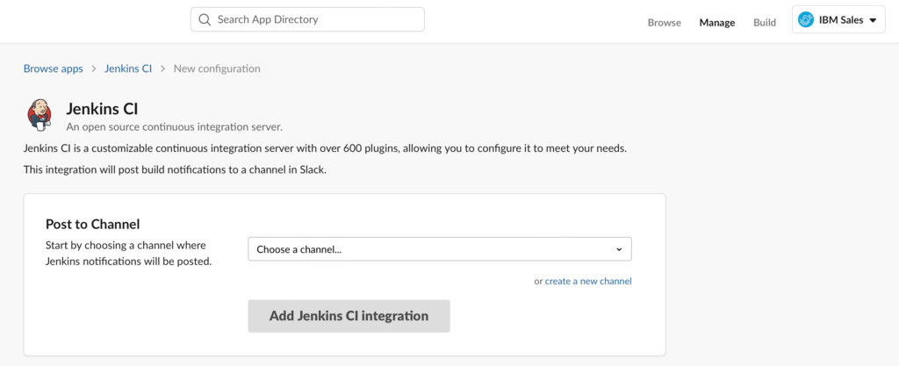
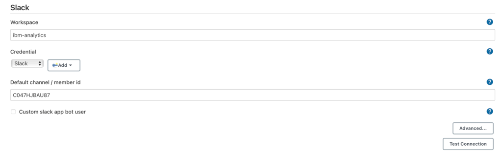
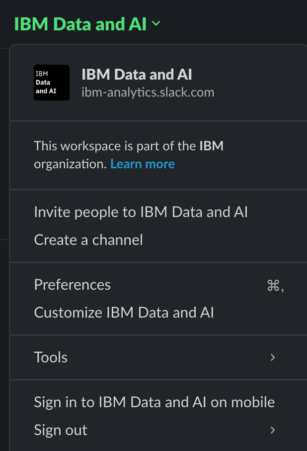
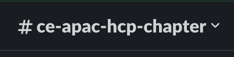
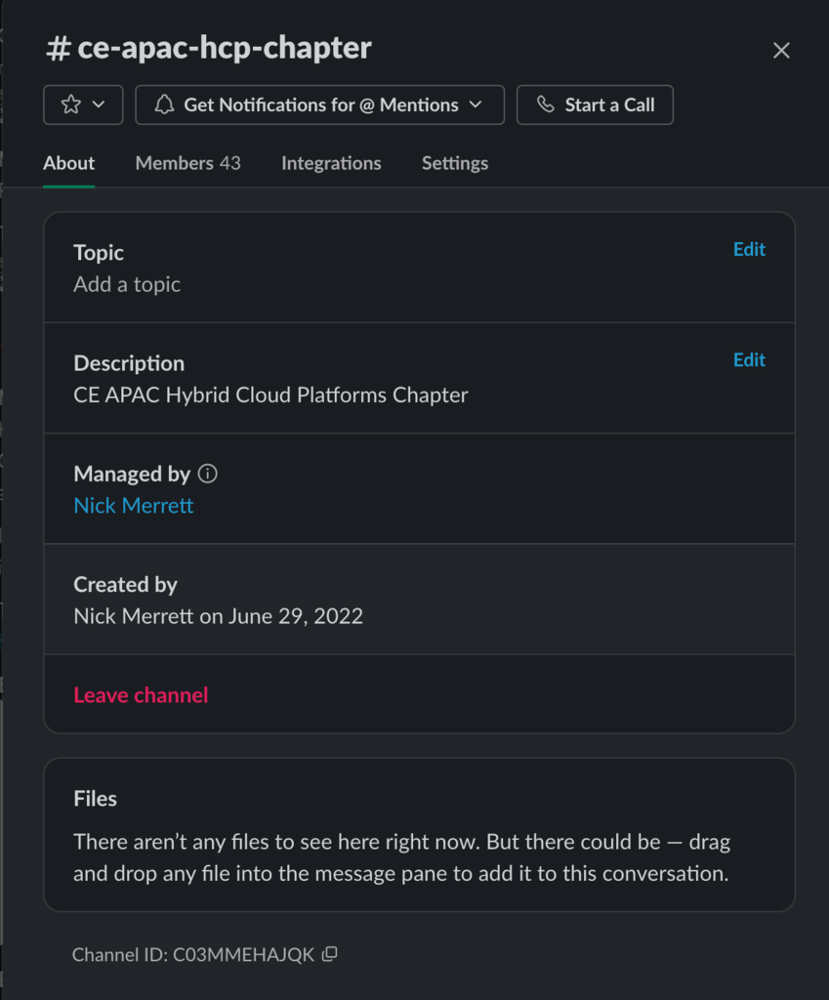

# Jenkins

## Overview

## Setting up Jenkins

We had to deploy a remote Jenkins instance. By default, pods running in OpenShift are configured under the default security context which means ssh’ing as an Administrator to perform adminstrative functions is out of the question. As such, we have spun up a virtual server on IBM Cloud and ran Jenkins as a docker image within it.

The procedure is a such:

1) Deploy a Centos 7.9 VSI on BM Cloud. Any server will do, so as long as Docker can be downloaded and installed.

2) Installed Docker on the VM. Steps given [here](https://docs.genesys.com/Documentation/System/latest/DDG/InstallationofDockerEngineCommunityEditiononCentOS7).
    1) Note: It would be ideal to make an image out of this server to be used in the future. This way, we don’t need to install Docker all the time.
    2) Note: Depending on the OS of the server you deployed, the steps required to install and run docker will likely be different. Consult the relevant documentation in such case.

3) Run docker command to run Jenkins. The command is as such:
    1) docker run --name jenkins -d -p 8080:8080 -p 50000:50000 --restart=on-failure -v jenkins_home:/var/jenkins_home jenkins/jenkins:lts-jdk11

4) Execute into the running jenkins container as root to install the python enviroment needed to execute the actual jenkins job later. *(NOTE: It would be ideal to make our own Jenkins image with these preinstalled defaults in the future. Save this image to our own registry to be used downstream with minimal fuss.)*
    1) docker exec -u 0 -it jenkins /bin/bash #start an interactive shell in the container as root
    2) apt-get update
    3) apt-get install python3
    4) apt-get install python3-pip
    5) apt-get install python3-venv
    6) cd var/jenkins_home/ #location where the build job expects the virtual enviroment
    7) python3 -m venv jenkins-env #setup virtual enviroment
    8) chown -R jenkins:jenkins jenkins-env/ #change owner from root to jenkins so it can be used in every build job
    

5) Configure the job within Jenkins *(NOTE: The user which executes the jenkins pipelines/scripts is the jenkins user by default. We made a targeted vritualenv for this user and dynamically installed the required dependencies on that env. This is performed by the Jenkins job (in the event the PR added a new library to the requirements.txt). This environment is used when the pipeline is triggered. Right now, we have a freestyle job. Future work includes making a Jenkinsfile pipeline out of this.)*
    1) Do all the steps under "Configuring Pull Requests to Trigger a Jenkins Job/Pipeline"
    2) set enviroment variables. There are two options: 
        1)  use credential binding (secure) [here](https://plugins.jenkins.io/credentials-binding/).  
        2)  set simple enviroment variables (easy)
            1)go to "Manage Jenkins">"Configure System">"Enviroment variables"
            2)add (Name:JOB; Value:Dev_Pipeline) (Name:KEY; Value:*an API Key you created within IBM Cloud*) (Name:PROJECT; Value:*The ID of your watson studio project*)
    4) navigate to Dashboard>your_job_name>Configuration and copy paste the content of jenkins/utils/template_job.sh into Build Steps>Execute shell and save
    5) Do a test run by clicking Dashboard>your_job_name>Build Now . You can check the output by clicking on the number of the build in the menu

## Configuring Pull Requests to Trigger a Jenkins Job/Pipeline
1. Install GitHub Pull Request Builder plugin
    1. Manage Jenkins > Manage Plugins > Available Tab and search for “Github pull request builder” > Checkbox for Install > Install without restart

2. Configure GitHub Pull Request Builder plugin
    1. Manage Jenkins > Configure System > GitHub Pull Request Builder
    2. Credentials > Add > Jenkins > Select Username with password for Kind
        1. Username: <YOUR_GITHUB_USERNAME>
        2. Password: <YOUR_GITHUB_TOKEN>
    3. Test Credentials >  Check Test basic connection to GitHub > Connect to API
        1. If you don’t have a GitHub token, you can create one in GitHub: Settings > Developer settings > Personal access tokens > Tokens (classic) > Generate new token > Enter jenkins-token for Note > Select repo and admin:repo_hook for Select scopes > Keep your token (! important)
        2. Correct Output: Connected to https://api.github.com as null (null) login: <YOUR_GITHUB_USERNAME>
    4. Add a username in Admin list
    5. Save

3. Configure GitHub Repository Webhook
    1. Go to your GitHub Repository > Settings > Webhooks > Add webhook
    2. Enter or Select
        1. Payload URL: <YOUR_JENKINS_HOST>/ghprbhook/
        2. Content type: application/json
        3. Which events would you like to trigger this webhook?: Let me select individual events. > Pull requests
    3. Add webhook

4. Create a Jenkins job and Configure it
    1. New Item > Enter an item name > Freestyle project > OK
    2. Click the project > Configure
        1. Description: Project to build on pull request to GitHub
        2. Check GitHub project and Enter Project url <YOUR_GITHUB_REPO_URL>
        3. Source Code Management > Git
            1. Repository URL: <YOUR_GITHUB_REPO_URL>
            2. Credentials: Select the credential you created previously
            3. Advanced > Refspec: +refs/pull/\*:refs/remotes/origin/pr/\*
            4. Branches to build: ${sha1}
        4. Build Triggers
            1. Check GitHub Pull Request Builder
            2. Check Use github hooks for build triggering

5. Test
    1. Create a new branch (master)
    2. Add a file and commit
    3. Raise a PR
    4. Check Build History in Jenkins

6. Additional Steps
    1. Go to your GitHub Repository > Settings > Branches > Branch protection rules > Add rule
        1. Branch name pattern: master
        2. Check Require status checks to pass before merging > Check Require branches to be up to date before merging

## Configuring Merge Requests (Git pushes) to Trigger a Jenkins Job/Pipeline
1. Install Generic Webhook Trigger plugin
    1. Manage Jenkins > Manage Plugins > Available Tab and search for “Generic Webhook Trigger” > Checkbox for Install > Install without restart
2. Create a Jenkins job and Configure it
    1. New Item > Enter an item name > Freestyle project > OK

    2. Click the project > Configure
        1. Description: Project to build on push to GitHub
        2. Check GitHub project and Enter Project url <YOUR_GITHUB_REPO_URL>
        3. Source Code Management > Git
            1. Repository URL: <YOUR_GITHUB_REPO_URL>
            2. Credentials: Select the credential you created previously
            3. Branches to build: */master
        4. Build Triggers
            1. Check Generic Webhook Trigger
            2. Post content parameters > Add
                1. Name of variable: IF_MERGED, Expression: $.pull_request.merged, JSONPath
                2. Name of variable: BRANCH, Expression: $.pull_request.base.ref, JSONPath
            3. Token: jenkins-push
            4. Optional Filter
                1. Expression: (?=.*true)(?=.\*pre-prod).\*
                2. Text: $IF_MERGED $BRANCH

3. Configure GitHub Repository Webhook
    1. Go to your GitHub Repository > Settings > Webhooks > Add webhook
    2. Enter or Select
        1. Payload URL: <YOUR_JENKINS_HOST>/generic-webhook-trigger/invoke?token=jenkins-push
        2. Content type: application/json
        3. Which events would you like to trigger this webhook?: Let me select individual events. > Push, Pull requests

4. Test
    1. Create a new branch (master)
    2. Add a file and commit
    3. Raise a PR
    4. Check Build History in Jenkins

## Configuring Jenkins Job to Send Slack Notifications

**Please note a Slack Adminstrator should perform this. If you are not a workspace admin, contact your workspace admin(s) to perform this procedure for you**.

Setting it up is quite simple. The main page is given [here](https://plugins.jenkins.io/slack/). Follow the link given in step 2.

Select the workspace as given in the top right of the screen. In the image above, the workspace is “IBM Sales”. Next, choose the channel as given in the “Choose a channel”. Note you should have administrative access to the workspace in question. Next, press “Add Jenkins CI Integration”

You will then be directed to a page containing a number of steps to follow along with documented usage instructions for this plugin. The procedure is relatively straightforward and should not be terribly complicated to configure. “Step 3” however is a little outdated. Perhaps an older Jenkins version was used. Recent versions resembles the following:

Please note the Workspace name may or may not coincide with the display name you see in Slack. For instance, consider the following:

The workspace display name is “IBM Data and AI” but the reference name is “ibm-analytics”. Errors will appear in the event the display name is used.

The channel id can be found as such:

Click on the channel. Navigate to the top of the screen where the channel name is visible. Click the dropdown as seen above.

The channel ID can be seen towards the bottom of the screen above. Not the best in terms of visibility but it will do. Use this value to populate the channel id text field in Jenkins.

